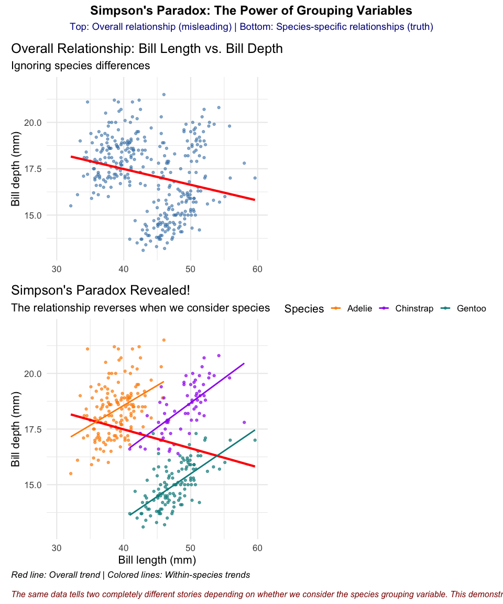

# Understanding Simpson’s Paradox


## Introduction to Simpson’s Paradox

**Simpson’s Paradox** is one of the most fascinating and dangerous
phenomena in data analysis. It occurs when a trend appears in different
groups of data but disappears or reverses when these groups are
combined. This paradox can lead to completely wrong conclusions if we
don’t look beyond surface-level statistics.

The classic example comes from UC Berkeley’s 1973 graduate admissions
data, where women appeared to be discriminated against in the overall
admission rates, but when examined by department, women actually had
equal or higher admission rates than men.

In this tutorial, we’ll explore Simpson’s Paradox using the beloved
Palmer Station penguin dataset, examining the relationship between bill
length and bill depth across different penguin species.

``` r
# Set CRAN mirror for package installation
options(repos = c(CRAN = "https://cran.rstudio.com/"))

# Install required packages if not already installed
if (!require(patchwork, quietly = TRUE)) {
  install.packages("patchwork")
  library(patchwork)
}

# Install required packages if not already installed
if (!require(palmerpenguins, quietly = TRUE)) {
  install.packages("palmerpenguins")
  library(palmerpenguins)
}

library(ggplot2)
data(penguins)
```

## The Data Story: Penguin Bill Dimensions

Let’s start by examining our data and building up to the paradox step by
step.

### A. The Overall Relationship

``` r
plot1 <- ggplot(data = penguins,
        aes(x = bill_length_mm,
        y = bill_depth_mm)) +
  theme_minimal(16) +
  geom_point(alpha = 0.6, color = "steelblue") +
  labs(title = "Overall Relationship: Bill Length vs. Bill Depth",
       subtitle = "Ignoring species differences",
       x = "Bill length (mm)",
       y = "Bill depth (mm)") +
  theme(plot.title.position = "plot",
        plot.caption = element_text(hjust = 0, face= "italic"),
        plot.caption.position = "plot") +
  geom_smooth(method = "lm", se = FALSE, color = "red", linewidth = 1.5) +
  # Set consistent axis limits for comparison
  xlim(30, 60) +
  ylim(13, 22)

plot1
```


At first glance, we see a **positive relationship** between bill length
and bill depth. The red trendline suggests that longer bills tend to be
deeper. This seems straightforward, but let’s dig deeper…

### B. The Hidden Truth: Species-Specific Relationships

Now let’s color our points by species and see what happens when we
examine the relationship within each group:

``` r
plot2 <- ggplot(data = penguins,
       aes(x = bill_length_mm,
           y = bill_depth_mm,
           color = species)) +
  theme_minimal(16) +
  geom_point(alpha = 0.7) +
  scale_color_manual(values = c("darkorange","purple","cyan4"),
                     name = "Species") +
  labs(title = "Simpson's Paradox Revealed!",
       subtitle = "The relationship reverses when we consider species",
       x = "Bill length (mm)",
       y = "Bill depth (mm)",
       caption = "Red line: Overall trend | Colored lines: Within-species trends") +
  theme(plot.title.position = "plot",
        plot.caption = element_text(hjust = 0, face = "italic"),
        plot.caption.position = "plot",
        legend.position = "bottom") +
  # Overall trend (ignoring species)
  geom_smooth(method = "lm", se = FALSE, color = "red", 
              linewidth = 1.5, alpha = 0.8) +
  # Species-specific trends
  geom_smooth(method = "lm", se = FALSE, linewidth = 1) +
  # Set consistent axis limits for comparison
  xlim(30, 60) +
  ylim(13, 22)

plot2
```


**The Paradox Revealed!** 🎯

Notice what just happened: - **Overall trend (red line):** Positive
relationship - longer bills are deeper - **Within each species (colored
lines):** Negative relationship - longer bills are actually shallower!

This is Simpson’s Paradox in action. The species variable is a
**confounding variable** that completely reverses the apparent
relationship when we aggregate the data.

### C. Side-by-Side Comparison

Now let’s create a compelling side-by-side comparison that makes
Simpson’s Paradox crystal clear:

``` r
# Load patchwork for combining plots
library(patchwork)

# Ensure plots are available (recreate if needed)
if (!exists("plot1") || !exists("plot2")) {
  # Recreate plot1
  plot1 <- ggplot(data = penguins,
          aes(x = bill_length_mm,
          y = bill_depth_mm)) +
    theme_minimal(16) +
    geom_point(alpha = 0.6, color = "steelblue") +
    labs(title = "Overall Relationship: Bill Length vs. Bill Depth",
         subtitle = "Ignoring species differences",
         x = "Bill length (mm)",
         y = "Bill depth (mm)") +
    theme(plot.title.position = "plot",
          plot.caption = element_text(hjust = 0, face= "italic"),
          plot.caption.position = "plot") +
    geom_smooth(method = "lm", se = FALSE, color = "red", linewidth = 1.5) +
    xlim(30, 60) +
    ylim(13, 22)
  
  # Recreate plot2
  plot2 <- ggplot(data = penguins,
         aes(x = bill_length_mm,
             y = bill_depth_mm,
             color = species)) +
    theme_minimal(16) +
    geom_point(alpha = 0.7) +
    scale_color_manual(values = c("darkorange","purple","cyan4"),
                       name = "Species") +
    labs(title = "Simpson's Paradox Revealed!",
         subtitle = "The relationship reverses when we consider species",
         x = "Bill length (mm)",
         y = "Bill depth (mm)",
         caption = "Red line: Overall trend | Colored lines: Within-species trends") +
    theme(plot.title.position = "plot",
          plot.caption = element_text(hjust = 0, face = "italic"),
          plot.caption.position = "plot",
          legend.position = "bottom") +
    geom_smooth(method = "lm", se = FALSE, color = "red", 
                linewidth = 1.5, alpha = 0.8) +
    geom_smooth(method = "lm", se = FALSE, linewidth = 1) +
    xlim(30, 60) +
    ylim(13, 22)
}

# Create the vertical comparison with clean axes
plot1_clean <- plot1 + labs(x = NULL)
comparison_plot <- plot1_clean / plot2

# Add layout and annotation
comparison_plot <- comparison_plot +
  plot_layout(
    ncol = 1,
    heights = c(1, 1.2),
    guides = "collect"
  ) +
  plot_annotation(
    title = "Simpson's Paradox: The Power of Grouping Variables",
    subtitle = "Top: Overall relationship (misleading) | Bottom: Species-specific relationships (truth)",
    caption = "The same data tells two completely different stories depending on whether we consider the species grouping variable. This demonstrates why context matters in data analysis.",
    theme = theme_minimal(16) +
      theme(
        plot.title = element_text(size = 18, face = "bold", hjust = 0.5),
        plot.subtitle = element_text(size = 14, hjust = 0.5, color = "darkblue"),
        plot.caption = element_text(size = 12, hjust = 0, face = "italic", color = "darkred"),
        plot.title.position = "plot",
        plot.caption.position = "plot"
      )
  )

comparison_plot
```



**The Power of Side-by-Side Comparison!** 🎯

This visualization perfectly demonstrates Simpson’s Paradox: - **Left
plot:** Shows the misleading overall positive relationship - **Right
plot:** Reveals the true negative relationships within each species -
**Clear contrast:** The same data tells two completely different
stories!

The side-by-side layout makes it impossible to ignore the paradox - you
can literally see how the red trendline flips direction when we consider
the species grouping variable.

## Key Takeaways: Lessons from Simpson’s Paradox

### The Power of Visualization

- **Always visualize your data** before drawing conclusions from
  statistical models
- A single trendline can be dangerously misleading when it masks
  underlying group differences
- **P-values are not the answer** - statistical significance doesn’t
  guarantee the relationship is meaningful or correctly interpreted

### Simpson’s Paradox Dangers

- **Aggregated data can reverse relationships** - what appears to be a
  positive correlation overall might be negative within each group
- **Business implications:** Making decisions based on aggregate trends
  without considering subgroups can lead to costly mistakes
- **The “lurking variable” problem:** Always ask “What am I missing?”
  when relationships seem counterintuitive

### Real-World Examples

- **UC Berkeley admissions (1973):** Overall admission rates suggested
  gender bias against women, but within each department, women had equal
  or higher admission rates
- **Baseball batting averages:** A player can have a higher batting
  average than another in both halves of a season, yet a lower overall
  average
- **Medical studies:** A treatment can appear harmful overall but
  beneficial within each age group
- **Marketing campaigns:** A campaign might seem ineffective overall but
  highly successful within specific customer segments

### Best Practices for Data Analysis

- **Stratify your analysis** by relevant grouping variables
  (demographics, categories, time periods)
- **Look for confounding variables** that might explain apparent
  relationships
- **Use multiple visualization approaches** (overall vs. faceted plots,
  side-by-side comparisons)
- **Question your assumptions** - if a relationship seems too good (or
  bad) to be true, it might be!

## Conclusion

Simpson’s Paradox teaches us that **context matters**. The penguin data
shows us that what appears to be a simple positive relationship between
bill length and depth is actually masking a more complex reality where
the relationship is negative within each species. This paradox reminds
us to always dig deeper, consider confounding variables, and never trust
aggregate statistics without examining the underlying groups.

Remember: **The truth is in the details, not in the summary
statistics.**
